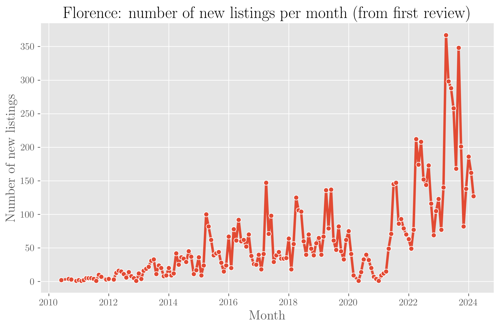

# La Raccolta Dati

Ogni analisi che si rispetti parte sempre da una raccolta dati o da una base dati già esistente. Dato che siamo interessati ad osservare il mercato degli affitti brevi in Italia sulla piattaforma AirBnB, la miglior risorsa attualmente disponibile è il sito [Inside Airbnb](https://insideAirbnb.com/get-the-data/).

Inside AirBnb permette di scaricare un anno di dati per varie zone di interesse, con snapshot della piattaforma Airbnb ogni circa 3 mesi. I dati che è possibile scaricare comprendono i seguenti file:

- **listings.csv** La lista delle strutture ricettive attive al momento dello snapshot.  
- **calendar.csv** Le date disponibili per ciascuna struttura **TODO: Guardare meglio questi dati e capire cosa sono**  
- **reviews.csv** Lo storico di tutte le recensioni di ciascuna struttura.  
- **neighbourhoods.geojson** Una divisione in quartieri o comuni dell'area di interesse.  

Considerando i dati italiani, non sembra esserci una ratio precisa dietro la raccolta presente in Inside Airbnb. Sono presenti varie città importanti dal punto di vista turistico e non (e.g. Roma, Milano, Venezia, Firenze, Napoli), ma anche intere regioni non suddivise in città o aree metropolitane (e.g. Sicilia). 

Abbiamo scaricato tutti i dati riguardanti l'Italia al momento e iniziato l'esplorazione dei dati per capirne meglio la struttura. L'idea è quella di avere uno storico sufficientemente lungo da poter osservare cambiamenti su periodi di vari anni. Per la policy stessa di Inside Airbnb, non ci è possibile condividere i dati che collezioniamo, ma potremo diffondere le analisi ed eventualmente gli script senza problemi.

Inside Airbnb non fornisce una documentazione approfondita dei vari campi presenti in ogni file e nella suddivisione spaziale di ogni area. In un prossimo post andremo a descrivere un po’ meglio quello che si trova nei vari file e come estrarre qualche informazione interessante. **NOTA: che ne pensi marti?**

Una prima domanda che ci è venuta spontanea è se fosse possibile usare questi dati per capire dove e quando nascono nuovi Airbnb. Gli snapshot trimestrali non consentono però di avere una granularità temporale molto elevata: possiamo osservare un nuovo Airbnb nascere o uno vecchio sparire solo ogni 3 mesi.

Abbiamo quindi pensato che un buon proxy per la data di inizio dell'attività di un Airbnb potesse essere la data della prima recensione (e specularmente l'ultima per la fine della sua attività). Queste ovviamente saranno solo date stimate, l'iscrizione su Airbnb è chiaramente avvenuta mesi prima della prima recensione. Stiamo inoltre escludendo tutte quelle sfortunate strutture che non ricevono nessuna recensione. Ci aspettiamo però che in città ad alta densità turistica questo succeda alquanto di rado.

# Trend Temporali di Firenze

Aggiungiamo un altro bias personale: scegliamo Firenze come primo caso di studio. Queste sono le date di ciascun snapshot (formato YYYY-MM-DD)

- 2024-03-24  
- 2024-06-22  
- 2024-12-20  
- 2025-03-15  
- 2025-06-19  

Possiamo quindi osservare le strutture su Airbnb a partire dal primo trimestre 2024. Se assumiamo che una struttura sia "nuova" nel mese in cui ha la sua prima recensione, possiamo contare il numero di nuove strutture nel tempo:

Come dicevamo, i dati delle recensioni contengono tutto lo storico e quindi troviamo facilmente strutture recensite per la prima volta nel 2010. Con un trend decisamente in crescita nel tempo.

Possiamo inoltre vedere dove sono localizzati negli anni i "nuovi" Airbnb all'interno dell'area di Firenze:

<iframe src='assets/listing_first_review.html' width='100%'></iframe> 

Si vede chiaramente che inizialmente gli Airbnb si concentrano in quello che è il centro storico, che è anche l'area a più alta densità turistica nella città. Negli ultimi anni invece, si vede una proliferazione esterna al centro che ingloba praticamente tutta l'area del comune.

Possiamo quindi dire che il fenomeno sta interessando le aree periferiche solo recentemente? **Ovviamente no!** Dato che osserviamo le strutture solo dal 2024, non abbiamo informazioni su quelle che erano effettivamente presenti in precedenza.  
Il fatto che la concentrazione di strutture con una prima recensione nel 2010 fosse prevalentemente in centro e che siano relativamente poche, fa pensare che il nostro campione di strutture soffra del (**Bias del Sopravvissuto**)[https://en.wikipedia.org/wiki/Survivorship_bias].

In poche parole, stiamo osservando un misto di strutture recenti e strutture molto vecchie, ma di queste ultime vediamo solo quelle che sono riuscite a non chiudere nel tempo e che verosimilmente si trovano nell'area più interessata dal turismo. Perciò è plausibile che nel 2010 altre strutture fuori dal centro di Firenze abbiano avuto la loro prima recensione, ma vista le diverse dinamiche del turismo all'epoca e la diversa conformazione urbana, non siano presenti nei dati del 2024, che è il primo anno che possiamo osservare nei nostri snapshot.

# Prossimi passi

L'idea a questo punto è quella di continuare a collezionare dati e infoltire il nostro storico sperando di osservare andamenti interessanti. Vari fenomeni a livello locale e globale possono avere un impatto sul mercato degli affitti brevi:

- Il dollaro debole e l'incertezza internazionale che riduce il turismo estero  
- Le [misure del comune](https://www.comune.firenze.it/novita/comunicati/locazioni-turistiche-brevi-fissate-dalla-giunta-superfici-minime-autorizzazioni) per regolamentare il mercato  
- La debolezza della domanda turistica interna [CITAZIO]()

# Data Collection

Every good analysis starts with data collection or an already existing dataset. Since we’re interested in looking at the short-term rental market in Italy on the AirBnB platform, the best resource currently available is the website [Inside Airbnb](https://insideAirbnb.com/get-the-data/).

Inside Airbnb lets you download a year of data for different areas of interest, with snapshots of the Airbnb platform roughly every 3 months. The data you can download includes the following files:

- **listings.csv** The list of active properties at the time of the snapshot.  
- **calendar.csv** The available dates for each property **TODO: Look more closely at these data and figure out what they are**  
- **reviews.csv** The history of all reviews for each property.  
- **neighbourhoods.geojson** A division into neighborhoods or municipalities of the area of interest.  

Looking at the Italian data, there doesn’t seem to be a precise rationale behind the collection in Inside Airbnb. Some major tourist cities are included (e.g. Rome, Milan, Venice, Florence, Naples), but also whole regions without subdivision into cities or metropolitan areas (e.g. Sicily).  

We downloaded all the data regarding Italy and started exploring it to better understand its structure. The idea is to build a sufficiently long history to observe changes over multiple years. Due to Inside Airbnb’s own policy, we can’t share the data we collect, but we can publish analyses and possibly the scripts without any issues.

Inside Airbnb doesn’t provide detailed documentation of the fields in each file or of the spatial subdivision of each area. In a future post we’ll go into a bit more detail about what’s inside each file and how to extract interesting insights. **NOTE: what do you think Marti?**

One of the first questions we asked ourselves was whether we could use these data to understand where and when new Airbnbs are created. The quarterly snapshots don’t give us very high temporal granularity: we can only see a new Airbnb appear, or an old one disappear, every 3 months.

We therefore thought that a good proxy for the start date of an Airbnb could be the date of its first review (and conversely, the last review for the end of its activity). These will obviously only be estimated dates, since the listing on Airbnb clearly happens months before the first review. We’re also excluding all those unlucky properties that never receive any reviews. However, we expect that in high-tourism-density cities this happens quite rarely.

# Time Trends in Florence

Let’s add another personal bias: we chose Florence as our first case study. These are the snapshot dates (format YYYY-MM-DD):

- 2024-03-24  
- 2024-06-22  
- 2024-12-20  
- 2025-03-15  
- 2025-06-19  

We can therefore observe the Airbnb properties starting from the first quarter of 2024. If we assume that a property is “new” in the month when it gets its first review, we can count the number of new properties over time:

As mentioned, the review data contain the full history, so we can easily find properties reviewed for the first time as far back as 2010. The trend is clearly growing over time.

We can also see where “new” Airbnbs are located over the years within the Florence area:

<iframe src='assets/listing_first_review.html' width='100%'></iframe> 

It’s clear that initially Airbnbs were concentrated in the historic center, which is also the area with the highest tourist density in the city. In recent years, however, we see a proliferation outside the center, covering practically the whole municipality.

So can we say that the phenomenon only recently started affecting peripheral areas? **Obviously not!** Since we only observe the properties starting from 2024, we don’t have information on those that were actually present earlier.  
The fact that the concentration of properties with a first review in 2010 was mainly in the center, and that they are relatively few, suggests that our sample suffers from (**Survivorship Bias**)[https://en.wikipedia.org/wiki/Survivorship_bias].

In other words, we’re looking at a mix of recent and very old properties, but for the latter we only see those that managed to survive over time—and these are most likely located in the areas with the highest tourist demand. It’s therefore plausible that in 2010 other properties outside the city center of Florence also received their first review, but due to the different dynamics of tourism at the time and the different urban landscape, they’re no longer present in the 2024 data, which is the first year we can observe through snapshots.

# Next Steps

The idea now is to keep collecting data and extend our history, hoping to observe interesting trends. Various local and global factors can impact the short-term rental market:

- A weak dollar and international uncertainty reducing foreign tourism  
- [Municipal regulations](https://www.comune.firenze.it/novita/comunicati/locazioni-turistiche-brevi-fissate-dalla-giunta-superfici-minime-autorizzazioni) to regulate the market  
- Weakness in domestic tourism demand [CITATION NEEDED]  

We’ll see what the future holds.  
